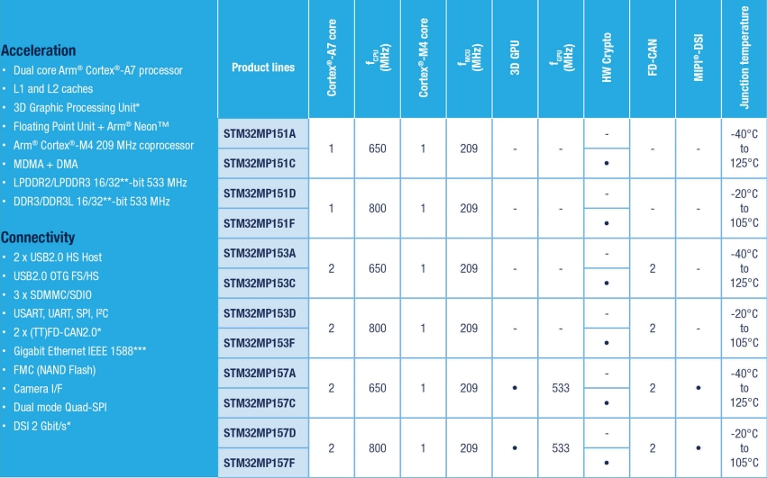

# [STM32MP15x](https://github.com/SoCXin/STM32MP15)

* [ST](https://www.st.com/en/microcontrollers-microprocessors/stm32-arm-cortex-mpus.html)：[Cortex-M4 + Cortex-A7](https://github.com/SoCXin/Cortex)
* [L7R7](https://github.com/SoCXin/Level)：209MHz + 800MHz

## [简介](https://github.com/SoCXin/STM32MP15/wiki)

[STM32MP15x](https://github.com/SoCXin/STM32MP15) 系列基于单核或双核Cortex-A7与Cortex-M4组成的异构架构，加强了支持多应用和灵活应用的能力，可以随时实现最佳性能和功率数据。Cortex-A7内核提供对开源操作系统（Linux/Android）的支持，而Cortex-M4内核可以利用STM32 MCU生态系统。

### 关键特性

* 800MHz Cortex®-A7
* 209MHz Cortex®-M4

#### 封装规格

* LFBGA448（18x18x1.7mm,P0.8mm）
* LFBGA354（16x16x1.7mm,P0.8mm）
* TFBGA361（12x12x1.2mm,P0.5mm）
* TFBGA257（10x10x1.2mm,P0.5mm）

### [资源收录](https://github.com/SoCXin/STM32MP15)

* [参考文档](docs/)
* [参考资源](src/)
* [参考工程](project/)

### [选型建议](https://github.com/SoCXin)

[STM32MP15](https://github.com/SoCXin/STM32MP15)

### [探索芯世界 www.SoC.xin](http://www.SoC.Xin)
