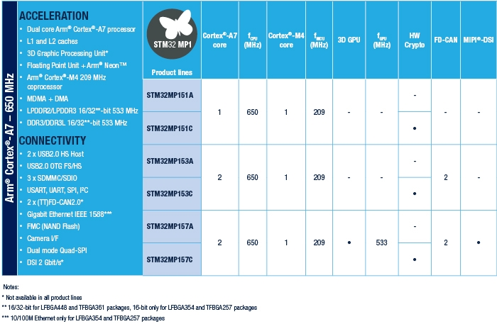

# [STM32MP1](https://github.com/sochub/STM32MP1)
 

#### [Vendor](https://github.com/sochub/Vendor) ：[ST](https://github.com/sochub/ST)
#### [Cortex](https://github.com/sochub/Cortex) ：[Cortex A7+M4](https://github.com/sochub/CA7)
#### [Level](https://github.com/sochub/Level)： M4 = 703 CoreMark @ 209 MHz

## [描述](https://github.com/sochub/STM32MP1/wiki) 

[STM32MP1](https://github.com/sochub/STM32MP1)是[STM32MP](https://www.st.com/zh/microcontrollers-microprocessors/stm32mp1-series.html)系列的首款产品，也是ST Cortex A内核融合发展的探索之作。

* Cortex®-A7 650 MHz
    * 32-Kbyte L1 Instruction cache
    * 32-Kbyte L1 Data cache
    * 256-Kbyte Level 2 cache
* Cortex®-M4 209 MHz

### 关键特性（核心买点）

* A+M融合

### [收录资源](https://github.com/sochub)

* [文档](docs/)
* [资源](src/)

### [关联资源](https://github.com/sochub)

### [选择建议](https://github.com/sochub)

[STM32MP1](https://github.com/sochub/STM32MP1) 实现A系列和M系列的融合，对于需要交互系统和实时控制的场合有需求感，值得探索发现，但就A系列的规格偏低，M系列中规中矩，在多接口设备中对体积限制不大情况下，只有更低的成本和开发效率是最大的傍身之本。

##  [SoC资源平台](http://www.qitas.cn)  
